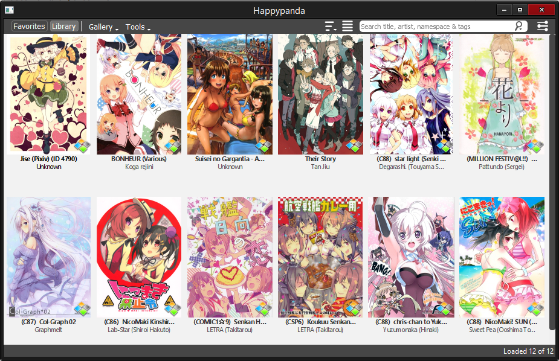
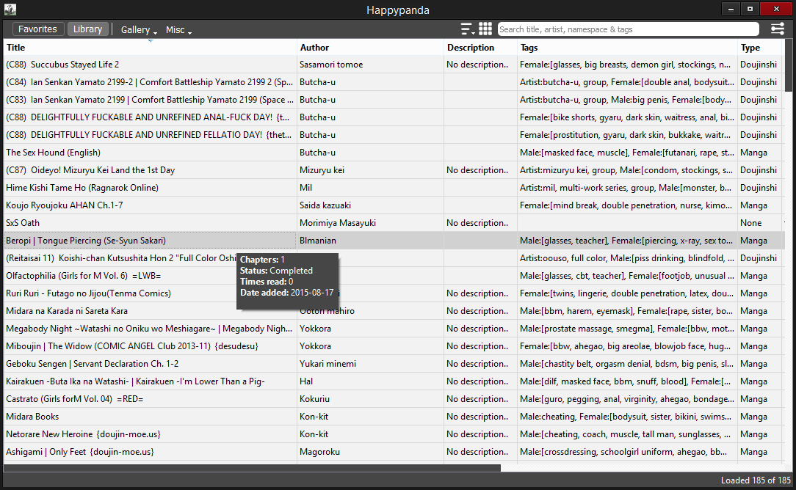

# Happypanda
A cross platform manga/doujinshi manager with tagging support.

I'm here if you have any questions!

# Screenshots

# How to install & run
*(I have only tested this on windows)*

For Mac & Linux see [INSTALL.md](INSTALL.md)

1. Download the installer from releases (located above the filetree)
2. Extract to desired location (avoid locations where you need admin rights)
3. Run the program by clicking on Happypanda

# Usage
- Click "Add series". Choose your series folder and edit the metadata, click done when... done.
- Or you can populate the program with all series' from folder by clicking on the arrow:
    - Currently supports the following folder structures *(Mixed structures are supported)*:
        + .../My_general_series_folder
            - --/Series1_folder
                - --/Chp_1_folder
                    - --/image_1
                    - --/image_2
                - --/Chp_n_folder
                    - --/image_n

        + .../My_general_series_folder
            - --/Series1_folder
                - --/image_1
                - --/image_2
            - --/Series_n_folder
                - --/image_n
                - --/image_n

- Edit/Remove/Open/Favourite series by rightclicking on it
- Doubleclick on series to open first chapter
- Click on a series to open a window with it's metadata
- Rightclick on empty space to add series

- If everything fails or you somehow messed up, then feel free to delete the DB folder and start over. Find me in the gitter chat, if you have any questions.

# Dependencies
I wanted to keep the list short (I know the pain of wasting hours trying to install the correct dependencies)
- Qt5 (Install this first) >= 5.4
- PyQt5
- requests (pip) >= 2.6.0

# Contributing

Meet me there!