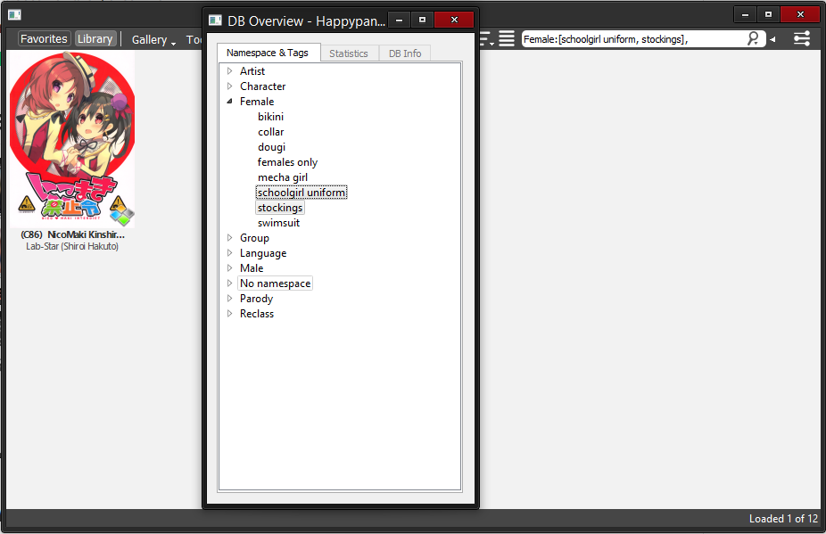

###### *[updated 13/3]* I will be taking a longer break from Happypanda to focus on my other projects (and more on school since exams are coming up). I'll probably start working on new features again in summer.. I'll still be available to answer issues, mails and gitter chat.

I'm available in the gitter chat if you have any questions!

Development is done in alpha branch

For future plans, see [issues](https://github.com/Pewpews/happypanda/issues)

For general documentation, check the [wiki](https://github.com/Pewpews/happypanda/wiki)

# Screenshots

# Features
- Portable, self-contained in folder and cross-platform
- Low memory footprint
- Advanced gallery search with regex support
- Gallery tagging: userdefined namespaces and tags
- Gallery metadata fetching from the web (supports various sources)
- Gallery downloading from the web (supports various sources)
- Folder monitoring
- Multiple ways of adding galleries to make it as convienient as possible!
- Recursive directory/archive scanning
- Supports ZIP/CBZ, RAR/CBR and directories with loose files
- Customizable by lots of settings
- And lots more...

# How to install and run
#### Windows
1. Download the archive from [releases](https://github.com/Pewpews/happypanda/releases)
2. Extract the archive in it's own folder
3. Find Happypanda.exe and double click on it!

#### Mac and Linux
see [INSTALL.md](INSTALL.md)

# How to update
Overwrite your previous installation.
More info in the [wiki](https://github.com/Pewpews/happypanda/wiki)

# Misc.
People wanting to import galleries from the Pururin database torrent should find [this](https://github.com/Exedge/Convertor) useful.

# Dependencies
- Qt5 (Install this first) >= 5.4
- PyQt5
- requests (pip)
- beautifulsoup4 (pip)
- watchdog (pip)
- scandir (pip)
- rarfile (pip)
- robobrowser (pip)
- Send2Trash (pip)
- Pillow (pip) or PIL
- python-dateutil (pip)

# Contributing
Please check the wiki.
